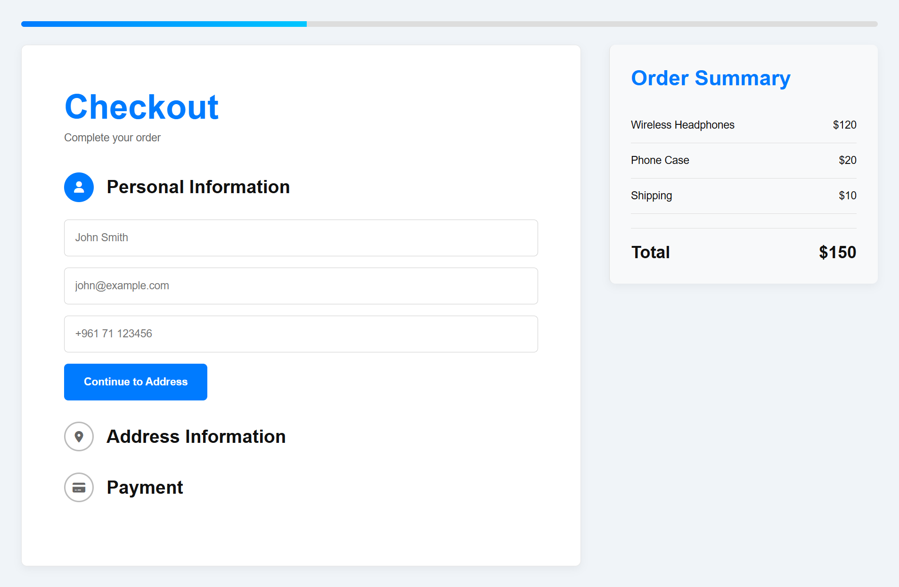
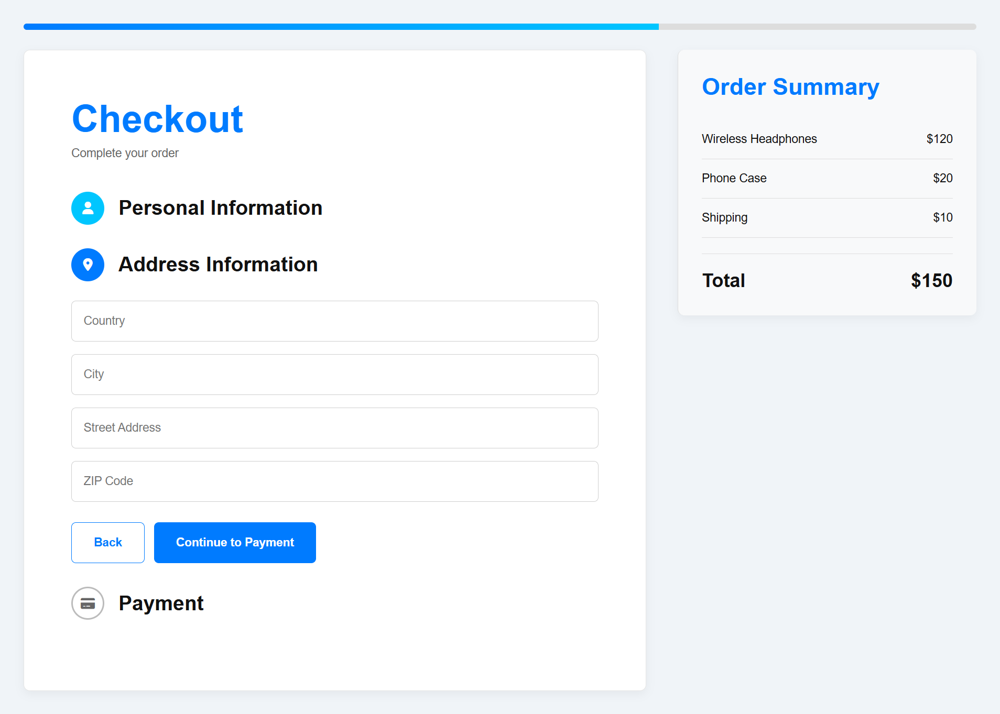
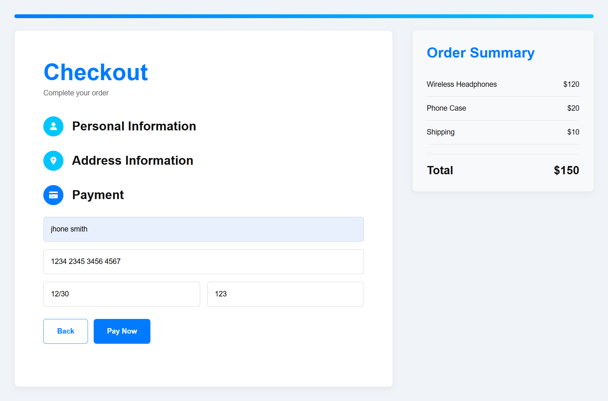
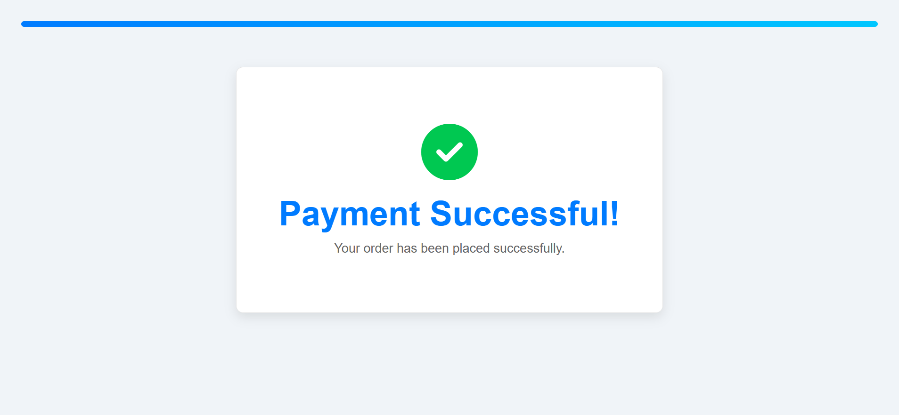
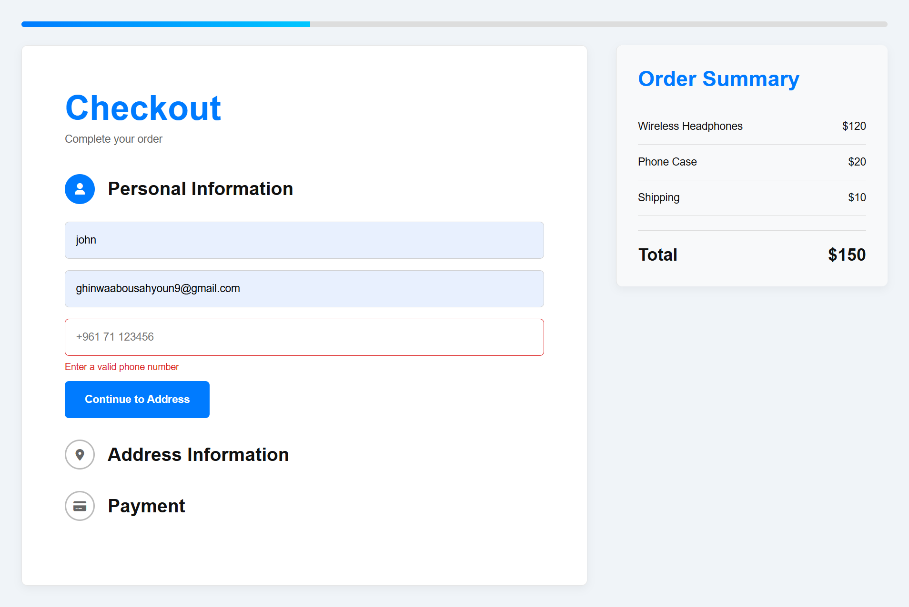

# Checkout-Flow 

## Project Overview

This project is a modern, responsive **3-step checkout system** built using **HTML, CSS, and JavaScript**.
It simulates a real e-commerce payment flow with form validation, step navigation, progress tracking, and a success 
confirmation screen.

The goal of this project is to demonstrate front-end development skills, user experience design, and form handling logic
similar to real-world payment systems.

---

## Features

### Step-by-Step Checkout

* Step 1: Personal Information
* Step 2: Address Information
* Step 3: Payment Details

### Progress Tracking

* Animated progress bar updates based on current step
* Step indicators (active / completed states)

### Form Validation

* Validates email format
* Checks required fields
* Phone number validation
* Credit card validation (16 digits)
* Expiry date format (MM/YY)
* CVV validation (3 digits)

### Payment Simulation

* Card number auto-formatting (XXXX XXXX XXXX XXXX)
* Expiry date auto-formatting (MM/YY)
* Loading animation on payment
* Success confirmation screen

### User Experience Enhancements

* Smooth transitions between steps
* Error messages displayed under inputs
* Disabled button during processing
* Confetti animation after successful payment

---

## Technologies Used

* HTML
* CSS 
* JavaScript 
* Font Awesome (icons)

---

## How It Works

1. User fills in personal information
2. System validates inputs before moving to next step
3. Address information is collected and validated
4. Payment details are entered and formatted automatically
5. On successful validation, a simulated payment is processed
6. Success screen is displayed with animation and confetti

---

## Preview

### Personal Information Step

### Address Information Step

### Payment Step

### Success Screen

### Error Screen

